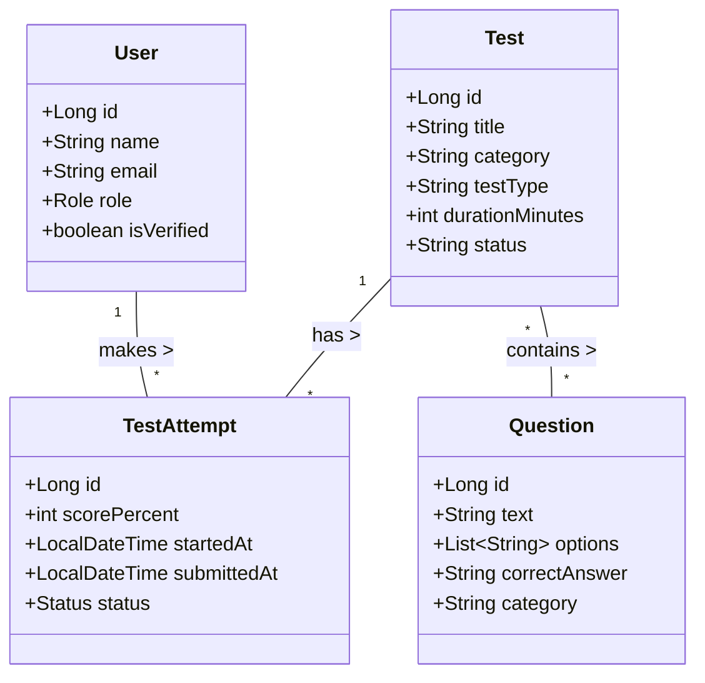
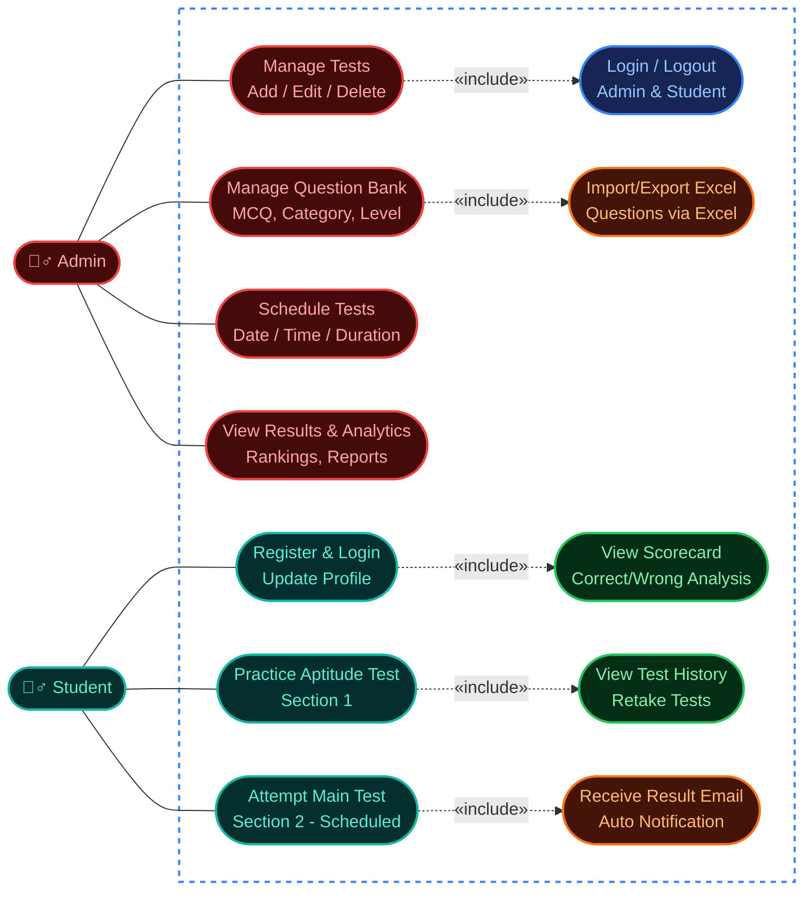
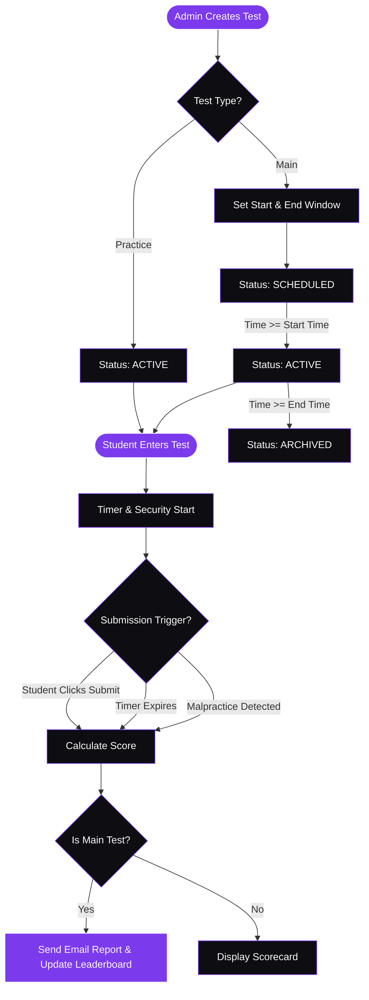

<div align="center">
  

  <br />
  <br />

  

  <p align="center">
    <b>Precision Assessment & Learning Intelligence</b><br/>
    <i>A unified platform for intelligent assessments, performance analytics, and academic growth.</i>
  </p>

  <p align="center">
    <a href="https://learniq-frontend-7oyn.onrender.com"><b>Live Platform</b></a> •
    <a href="#-platform-preview"><b>Preview</b></a> •
    <a href="#-core-features"><b>Features</b></a> •
    <a href="#-system-architecture"><b>Architecture</b></a> •
    <a href="#-deployment-render"><b>Deployment</b></a>
  </p>
</div>

---

LearnIQ is an advanced assessment and learning platform designed for structured testing and performance tracking. It provides a synchronized, high-fidelity testing environment for students and a comprehensive intelligence dashboard for system administrators.

## 🚀 Live Environment

*   **Student & Admin Portal:** [https://learniq-frontend-7oyn.onrender.com](https://learniq-frontend-7oyn.onrender.com)
*   **API Endpoint:** `https://learniq-backend-vglf.onrender.com/api/v1`

## 📸 Platform Preview

<div align="center">

### 1. Authentication Experience

<br/><br/>

<br/><br/>


<br/><br/>

### 2. Student Intelligence Portal

<br/><br/>


<br/><br/>

### 3. Administrative Control Center

<br/><br/>

<br/><br/>


<br/><br/>

### 4. Mobile Experience
*Fully responsive interface across all modules.*
<br/><br/>

&nbsp;&nbsp;

<br/><br/>

&nbsp;&nbsp;


</div>

## ✨ Core Features

### Student Portal (Identity)
*   **Unified Dashboard:** View upcoming, active, and completed assessments in a clean, dark-mode interface.
*   **Synchronized Testing:** Real-time test environment with auto-save and robust time-sync logic.
*   **Performance Intelligence:** Post-test summary reports detailing score, system rank, and time analytics.
*   **Automated Delivery:** Results and analytics delivered directly via secure email integration.

### Admin Portal (Authority)
*   **Assessment Control:** Create, schedule, and orchestrate tests globally.
*   **Question Library:** Centralized bank for managing multi-option, randomized assessment items.
*   **System Analytics:** High-level views of system performance, leaderboards, and individual student statistics.
*   **Identity Management:** Strict role-based access control ensuring data integrity and session isolation.

## 🧠 System Architecture

*   **Frontend:** React 18 + Vite (Tailwind CSS, Lucide React)
*   **Backend:** Java 17 + Spring Boot 3
*   **Authentication:** JWT (JSON Web Tokens) with strict Spring Security filters
*   **Database:** PostgreSQL (Production) / H2 (Local Development)
*   **Deployment:** Render (Static SPA & Web Service)
*   **Email:** JavaMail with SMTP delivery integration
*   **Authorization:** Role-based access control (ADMIN/STUDENT session isolation)

## 📊 System Models & Workflows

### 1. Entity-Relationship (Database Schema)
*This diagram illustrates the core database tables and how they connect to store your platform's data.*


### 2. Platform Use Cases
*Mapping the distinct capabilities available to the Student and Administrator roles.*


### 3. Assessment Lifecycle Flowchart
*Visualizing the state transitions from test creation to auto-submission.*


## 💻 Local Environment Setup

### 1. Repository
```bash
git clone https://github.com/Nishantsg3/LearnIQ.git
cd LearnIQ
```

### 2. Backend Boot
Navigate to `learniq-backend` and configure your environment variables based on `.env.example`, then run:
```bash
mvn spring-boot:run
```

### 3. Frontend Boot
Navigate to `learniq-frontend`, install dependencies, and start the Vite server:
```bash
npm install
npm run dev
```

## 🌐 Deployment (Render)

### Frontend (Static SPA)
*   **Directory:** `learniq-frontend`
*   **Build Command:** `npm install && npm run build`
*   **Publish Directory:** `dist`
*   **Environment:** `VITE_API_URL` (Set to backend URL)

### Backend (Web Service)
*   **Directory:** `learniq-backend`
*   **Build Command:** `mvn clean package -DskipTests`
*   **Start Command:** `java -jar target/*.jar`
*   **Environment Variables:**
    *   `SPRING_PROFILES_ACTIVE`: `prod`
    *   `MAIL_USERNAME` / `MAIL_PASSWORD`: SMTP Credentials
    *   `SPRING_DATASOURCE_*`: Database connection strings

---
<div align="center">
  
  <p>LEARN<b>IQ</b> © 2026</p>
</div>
